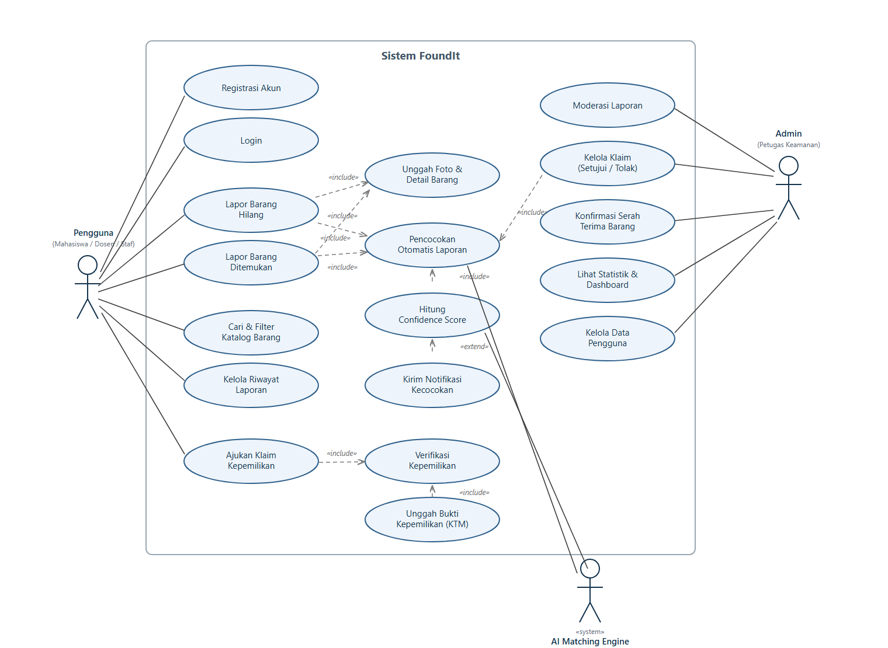
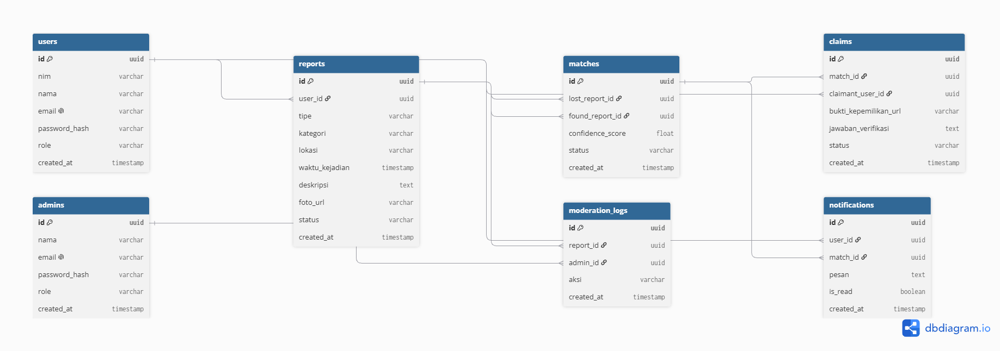
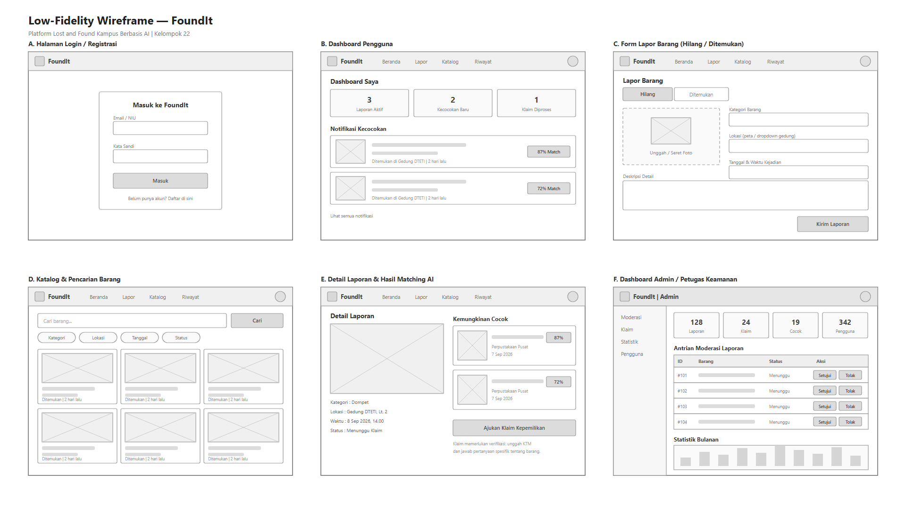

# FoundIt

**Project Senior Project TI**
Departemen Teknologi Elektro dan Teknologi Informasi, Fakultas Teknik, Universitas Gadjah Mada

## Anggota Kelompok

| Nama | NIM | Peran |
|---|---|---|
| Sri Wahyuni Arista | 23/521971/TK/57593 | AI Engineer, Cloud Engineer |
| Muhammad Farrel Al Ghazy | 24/540589/TK/60022 | UI/UX Designer, Software Engineer (Front-End) |
| Mayravivania Syahda Charisa | 24/538308/TK/59701 | Project Manager, Software Engineer (Back-End) |

---

## Nama Produk

**FoundIt**

## Jenis Produk

Platform *lost and found* berbasis web yang mengintegrasikan kecerdasan buatan (AI) untuk secara otomatis mencocokkan laporan barang hilang (*Lost Item*) dan barang ditemukan (*Found Item*).

## Latar Belakang & Permasalahan

Kehilangan barang di lingkungan kampus merupakan permasalahan universal yang terus muncul dan berdampak secara teknis maupun administratif bagi mahasiswa, dosen, dan staf akademis. Survei terhadap 73 mahasiswa Politeknik Negeri Jakarta menunjukkan 79,5% responden pernah kehilangan barang di kampus, dan lebih dari 91% di antaranya kesulitan menemukan informasi barang temuan karena sistem pelaporan masih manual dan tidak terpusat.

Beberapa data pendukung dari kampus lain di Indonesia:
- **ITS**: ±700 laporan kehilangan (Jan-Sep 2024), sistem masih memakai Google Form internal yang informasinya tidak tersebar ke seluruh sivitas akademika.
- **UNESA**: 393 kasus kehilangan (Agu 2023-Agu 2025), sistem pelaporan masih pakai buku mutasi dan handy talkie sehingga alur informasi tidak terstruktur dan berisiko kehilangan data.
- **FTUI**: membentuk tim pengembangan sistem Lost and Found terintegrasi (Feb 2025) karena pengelolaan barang hilang/ditemukan masih berjalan terpisah di tiap unit.

**Rumusan Permasalahan:**
1. Proses pelaporan dan pencarian barang hilang di kampus masih tersebar dan tidak terpusat (papan info, Twitter/X, grup WA/Line per angkatan, satpam per gedung).
2. Penemu barang sering enggan melapor karena proses manual dirasa merepotkan.
3. Tidak ada mekanisme otomatis yang mencocokkan laporan "kehilangan" dan "penemuan" berdasarkan kemiripan visual, lokasi, dan waktu.
4. Tidak ada verifikasi kepemilikan, sehingga berisiko terjadi klaim palsu.

## Ide Solusi

FoundIt menggabungkan teknologi **Computer Vision** (pemrosesan citra) dan **Natural Language Processing (NLP) dengan Vector Embeddings** (pemrosesan teks) untuk memberikan analisis kemiripan yang mendalam antara laporan barang hilang dan ditemukan.

Pengguna cukup melaporkan barang dengan mengunggah foto, lokasi, waktu, dan deskripsi. Sistem AI membandingkan fitur visual gambar serta kemiripan konteks teks untuk menghasilkan **Confidence Score** (misalnya "87% Match"), sehingga pengguna dan admin dapat memprioritaskan pencocokan paling potensial. Setelah kecocokan ditemukan, proses klaim difasilitasi melalui mekanisme **verifikasi kepemilikan**.

**Rancangan Fitur:**

| Fitur | Keterangan |
|---|---|
| Lapor barang hilang/ditemukan | Upload foto, pilih lokasi (peta/dropdown gedung), waktu kejadian, dan deskripsi detail |
| Smart AI Matching Engine | Computer Vision + NLP/Vector Embeddings menghasilkan Confidence Score (0-100%) |
| Dashboard & Notifikasi Real-Time | Riwayat laporan, status klaim, notifikasi otomatis saat ada kecocokan tinggi |
| Verifikasi Kepemilikan (Claim Verification) | Cocokkan KTM, jawab pertanyaan spesifik, atau bukti kepemilikan tambahan |
| Dashboard Admin/Petugas Keamanan | Moderasi laporan, verifikasi data, monitor klaim, kelola pengguna & statistik |
| Riwayat & Pencarian Lanjutan | Pencarian berdasarkan kategori, lokasi, atau rentang waktu |

## Analisis Kompetitor

**1. @ugmfess (autobase Twitter/X UGM)**: (*Indirect competitor*)
Jangkauan luas, gratis, dan anonim, tapi bukan platform lost & found sungguhan — laporan tenggelam dalam hitungan menit, tidak ada pencarian terstruktur, pencocokan otomatis, maupun verifikasi kepemilikan.

**2. Crowdfind**: (*Indirect competitor*)
Software lost & found berbayar untuk institusi (dipakai Virginia Tech, Rutgers). Model top-down (hanya staf yang bisa mendaftarkan barang), berbayar, dan tidak terlokalisasi untuk kampus Indonesia.

**3. Layanan lost & found manual kampus** (pos satpam/sekretariat departemen): (*Direct competitor*)
Barang tersimpan fisik dan resmi, tapi tersebar di banyak titik yang tidak saling terhubung, pendataan minim, dan pemilik harus menebak & datang langsung ke tiap lokasi.

**Keunggulan FoundIt:** menggabungkan legitimasi institusional dan kemudahan pelaporan mandiri lewat satu katalog terpusat dengan pencocokan otomatis berbasis AI (visual, deskripsi, lokasi, dan waktu), sesuatu yang tidak dimiliki satupun kompetitor di atas.

---

## Perancangan SDLC

### Metodologi Pengembangan

**Metodologi yang digunakan: Agile (Scrum)**

FoundIt mengandalkan fitur AI Matching Engine berbasis Computer Vision dan NLP yang membutuhkan banyak iterasi eksperimen dan tuning model. Karena itu, kebutuhan atau *requirement* fitur AI kemungkinan akan berubah selama proses pengembangan.

Model Agile memungkinkan tim mengembangkan dan merilis fitur secara bertahap, misalnya dimulai dari fitur pelaporan barang, kemudian AI Matching Engine, dan dilanjutkan dengan fitur verifikasi klaim. Dengan pendekatan ini, tim dapat memperoleh *feedback* pengguna lebih cepat dan lebih mudah menyesuaikan perubahan *requirement* dibandingkan model Waterfall.

Selain itu, tim yang terdiri dari 3 orang dengan peran Frontend, Backend/Project Manager, dan AI/Cloud dapat bekerja secara paralel dalam setiap sprint.

### Tujuan Produk

Membangun platform *lost and found* digital berbasis AI yang memusatkan proses pelaporan dan pencarian barang hilang atau ditemukan di lingkungan kampus. Platform ini bertujuan mempercepat dan meningkatkan akurasi proses pengembalian barang kepada pemiliknya secara terstruktur dan terdokumentasi, sekaligus menggantikan proses manual yang masih tersebar di berbagai platform seperti media sosial, papan informasi, dan pos satpam yang belum saling terhubung.

### Pengguna Potensial & Kebutuhannya

| Pengguna | Kebutuhan |
|---|---|
| Mahasiswa/dosen/staf yang **kehilangan barang** | Cara mudah untuk melaporkan kehilangan dan mendapatkan notifikasi otomatis ketika ditemukan barang yang memiliki kemiripan, tanpa harus mencari informasi melalui berbagai media sosial atau mendatangi banyak pos keamanan. |
| Mahasiswa/dosen/staf yang **menemukan barang** | Cara cepat dan praktis untuk melaporkan barang temuan, cukup dengan mengunggah foto serta memasukkan lokasi dan waktu ditemukan tanpa harus menulis deskripsi secara panjang. |
| **Petugas keamanan kampus/admin** | Dashboard terpusat untuk memantau dan memoderasi laporan barang hilang maupun temuan, memverifikasi klaim dari pengguna untuk mencegah klaim palsu, serta melihat statistik terkait barang hilang dan ditemukan di lingkungan kampus. |

### Use Case Diagram

Sistem melibatkan tiga aktor: **Pengguna** (mahasiswa/dosen/staf), **Admin** (petugas keamanan), dan **AI Matching Engine** sebagai *system actor* yang menjalankan pencocokan otomatis dan perhitungan *confidence score*.

### Functional Requirements

| FR | Deskripsi |
|---|---|
| FR 1 | Sistem harus memungkinkan pengguna melakukan registrasi akun menggunakan email dan kata sandi. |
| FR 2 | Sistem harus memungkinkan pengguna melakukan login menggunakan akun yang telah terdaftar. |
| FR 3 | Sistem harus memungkinkan pengguna membuat laporan barang hilang dengan mengisi kategori, lokasi, waktu kejadian, dan deskripsi detail. |
| FR 4 | Sistem harus memungkinkan pengguna membuat laporan barang ditemukan dengan mengisi kategori, lokasi, waktu ditemukan, dan deskripsi detail. |
| FR 5 | Sistem harus memungkinkan pengguna mengunggah foto barang sebagai bagian dari laporan hilang/ditemukan. |
| FR 6 | Sistem harus secara otomatis mencocokkan laporan barang hilang dengan laporan barang ditemukan berdasarkan kemiripan visual, deskripsi, lokasi, dan waktu. |
| FR 7 | Sistem harus menghitung dan menampilkan *confidence score* (persentase kecocokan) antara pasangan laporan hilang dan ditemukan. |
| FR 8 | Sistem harus mengirimkan notifikasi otomatis kepada pengguna ketika ditemukan kecocokan dengan skor tinggi. |
| FR 9 | Sistem harus memungkinkan pengguna mencari dan memfilter katalog barang berdasarkan kategori, lokasi, tanggal, dan status. |
| FR 10 | Sistem harus memungkinkan pengguna melihat dan mengelola riwayat laporan yang pernah dibuat. |
| FR 11 | Sistem harus memungkinkan pengguna mengajukan klaim kepemilikan atas barang yang ditemukan. |
| FR 12 | Sistem harus memverifikasi kepemilikan barang melalui pencocokan KTM dan/atau pertanyaan spesifik terkait barang. |
| FR 13 | Sistem harus memungkinkan pengguna mengunggah bukti kepemilikan tambahan (misalnya foto KTM) sebagai bagian dari proses verifikasi klaim. |
| FR 14 | Sistem harus memungkinkan admin/petugas keamanan memoderasi (menyetujui/menolak) laporan yang masuk sebelum ditampilkan di katalog. |
| FR 15 | Sistem harus memungkinkan admin mengelola pengajuan klaim (menyetujui atau menolak klaim kepemilikan). |
| FR 16 | Sistem harus memungkinkan admin mengonfirmasi proses serah terima barang antara penemu dan pemilik. |
| FR 17 | Sistem harus menyediakan dashboard statistik bagi admin terkait jumlah laporan, klaim, dan tingkat kecocokan. |
| FR 18 | Sistem harus memungkinkan admin mengelola data pengguna terdaftar. |

### Entity Relationship Diagram (ERD)

### Low-Fidelity Wireframe

| Halaman | Use case yang diwadahi |
|---|---|
| A. Login / Registrasi | FR 1, FR 2 |
| B. Dashboard Pengguna | FR 8, FR 10 |
| C. Form Lapor Barang | FR 3, FR 4, FR 5 |
| D. Katalog & Pencarian | FR 9 |
| E. Detail & Hasil Matching | FR 6, FR 7, FR 11, FR 12, FR 13 |
| F. Dashboard Admin | FR 14, FR 15, FR 16, FR 17, FR 18 |

### Gantt Chart Pengerjaan 1 Semester

| Kegiatan | 1 | 2 | 3 | 4 | 5 | 6 | 7 | 8 | 9 | 10 | 11 | 12 |
|---|:-:|:-:|:-:|:-:|:-:|:-:|:-:|:-:|:-:|:-:|:-:|:-:|
| Brainstorming & Riset Kebutuhan | ■ | ■ | | | | | | | | | | |
| Perancangan (Use Case, ERD, Wireframe) | | ■ | ■ | | | | | | | | | |
| Setup Repo, CI/CD, Environment | | ■ | ■ | | | | | | | | | |
| Development - Modul Lapor Barang | | | | ■ | ■ | ■ | | | | | | |
| Development - AI Matching Engine | | | | | ■ | ■ | ■ | ■ | | | | |
| Development - Verifikasi & Klaim | | | | | | | ■ | ■ | | | | |
| Development - Dashboard Admin | | | | | | | | ■ | ■ | | | |
| Testing & Bug Fixing | | | | | | | | | ■ | ■ | | |
| Deployment | | | | | | | | | | ■ | ■ | |
| Evaluasi & Maintenance | | | | | | | | | | | ■ | ■ |

*Kolom 1-12 merujuk pada pertemuan perkuliahan.*
